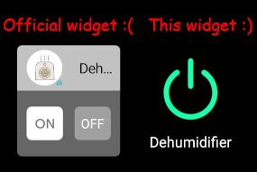

# Kasa Widget for Android (unofficial)

This is a homemade Android widget for turning [Kasa Smart](https://www.kasasmart.com/us) devices on and off. I'm not affiliated with TP-Link in any way.

I created this widget because I was unsatisfied with the [official one](https://play.google.com/store/apps/details?id=com.tplink.kasa_android). Mine is better because:

- **It's easier to use.** The official Kasa widget takes up a huge area, asking for 3x1 screen cells by default! And yet so little of that space is dedicated to the buttons. At right is what happens when you shrink both the official widget and mine down to 1x1. Tapping my widget's giant icon will toggle the device state - no need to aim for those tiny `ON` and `OFF` buttons.

- **It actually works.** The official widget was pretty flaky for me, often failing to turn my devices on and off. I haven't run into that problem with my widget.

- **It shows the device's current state.** My widget turns green when the device is on and gray when it's off. The official widget leaves you guessing. (Note that if you change your device's state via any method _other than_ this widget, it may take up to 30 minutes for the color to reflect that. This lag is a [limitation](https://developer.android.com/reference/android/appwidget/AppWidgetProviderInfo#updatePeriodMillis) of Android widgets.)

## Usage

1. Set up your Kasa Smart device using [their app](https://play.google.com/store/apps/details?id=com.tplink.kasa_android)
1. Install this widget from Android Studio
   - Someday I'll upload this to the Play store...
1. [Add](https://www.businessinsider.com/how-to-add-widgets-android) the "Kasa Widget" widget to your home screen
1. Enter in your Kasa account details and device name, e.g. `Bedroom lamp`
